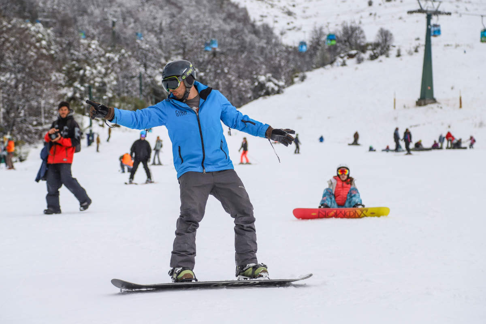

# Snowboard

## artifacts

## process

### step-1
Since this is an image, the first thing I did was open the image in notepad. 
In the very first line we can see a 'flag': `CTFlearn{CTFIsEasy!!!}` which is almost certainly not the real flag, but I'm going to plug it in anyway. 
And as expected it is not the flag, but oh well. 

### step-2
I open the image in Cyberchef, but Magic doesn't give me anything useful. 
I scroll through the text for a bit and realise that there is strange string, just beside the dummy flag, that looks sort of out of place: `Q1RGbGVhcm57U2tpQmFuZmZ9Cg`. 
Ok, let's plug that into input and see what Magic does. And we found it.

## flag
From Base64 on Cybershef will produce the flag. `CTFlearn{SkiBanff}`
